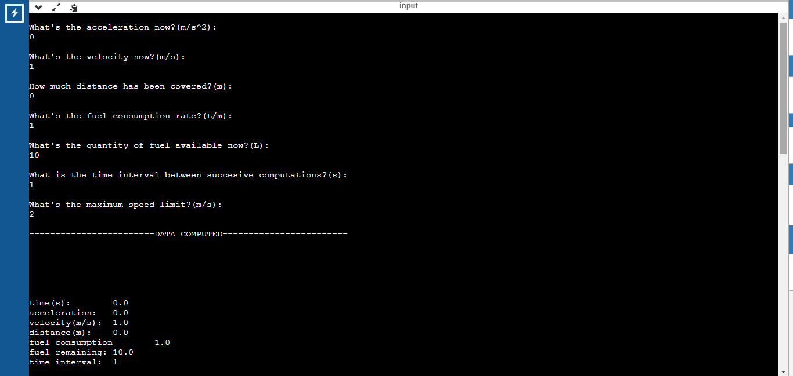
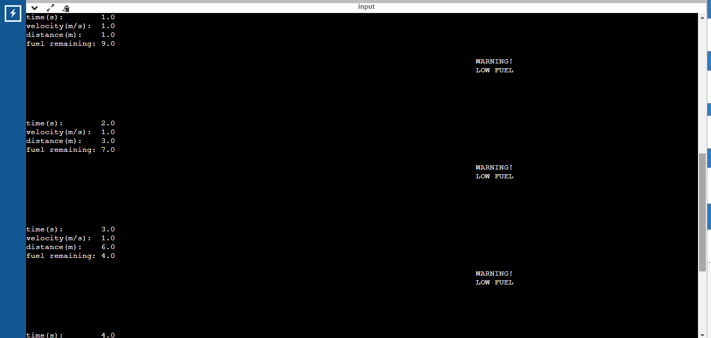
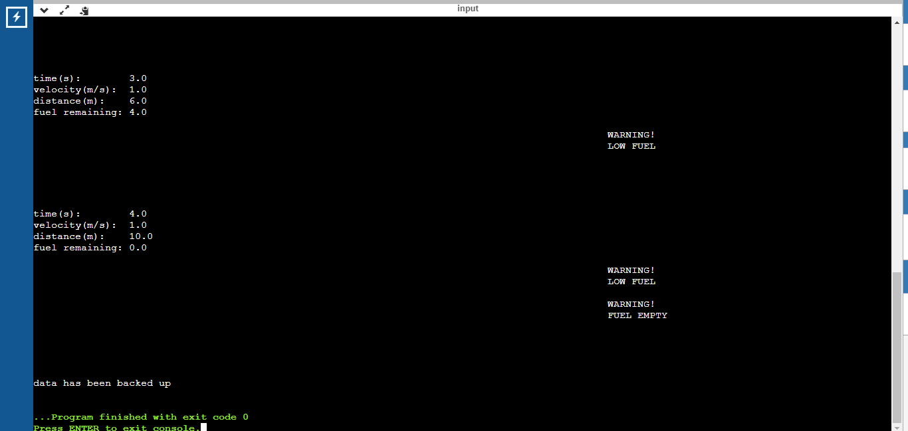
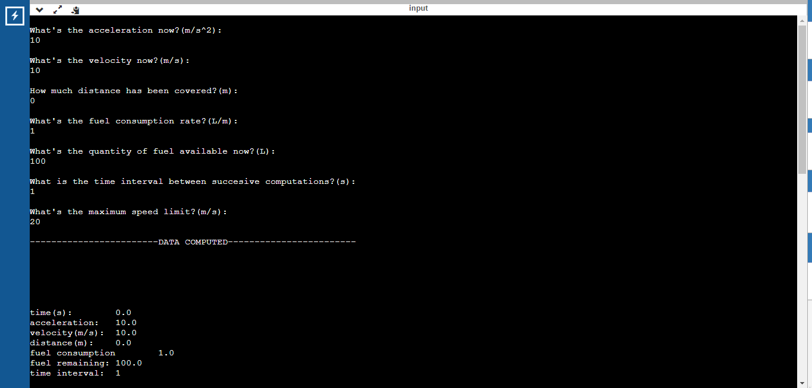
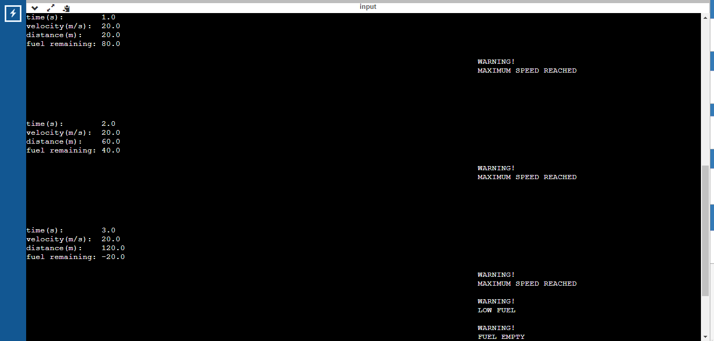
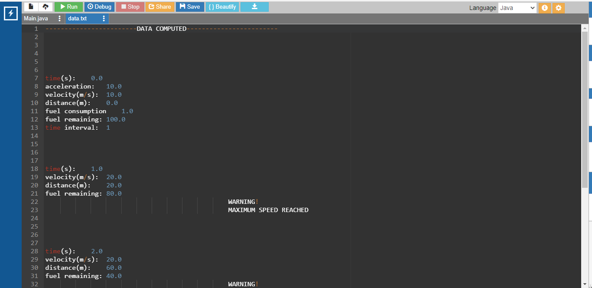

Kinematic Data Computation System

A Java program to utilise initial data and compute the values of basic kinematic quantities for a moving body at regular intervals of time. 
The data is backed up to a file named data.txt which is created(If not exists) automatically upon termination. 
Initial data is obtained from the user which consists of following quantities in International System of Units, 
acceleration : metres/second^2 
speed or velocity : metres/second 
distance : metres (covered already) 
fuel consumption rate : litres/metre 
available fuel : litres  
time interval : seconds 
maximum speed limit : metres/second 
 NOTE, 
Initial time =0 s. 
Acceleration is constant. 
If speed is constant then acceleration has to be 0. 
After acheiving it's maximum value speed becomes constant. 
Low fuel warning is activated when fuel is less than 10 litres 
Computation ceases when fuel is equal to or less than 0 L. 

Case 1 : zero acceleration -> constant velocity

case 2 : non zero acceleration -> velocity changes with respect to time

data has been backed up to data.txt file

